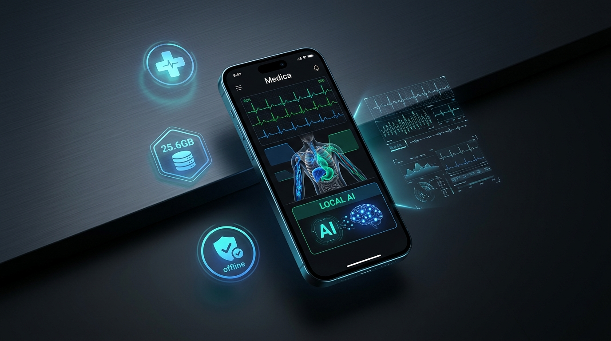
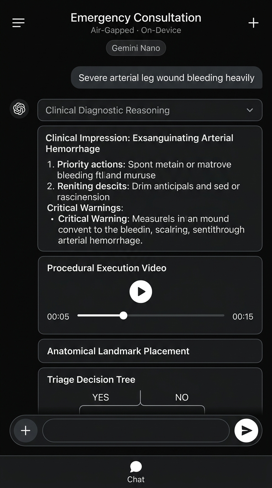
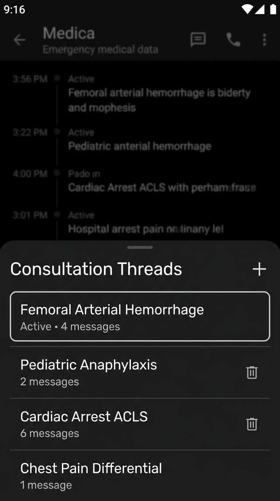
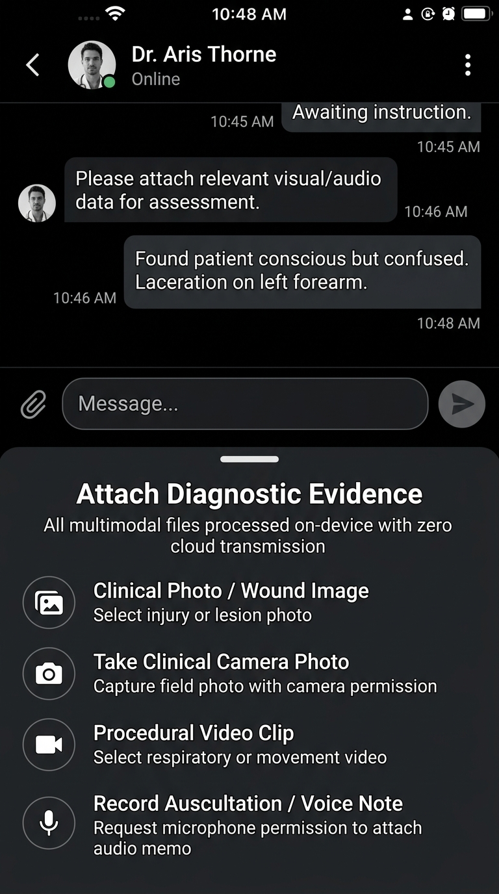
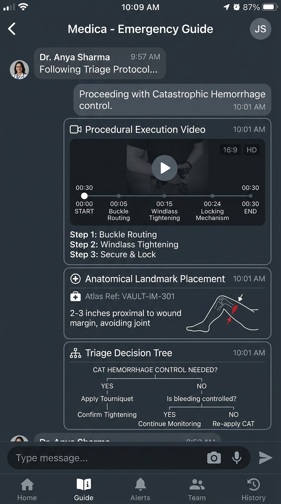

# 🩺 MEDICA

### 100% On-Device · Multimodal · Zero-Cloud Emergency Medical Intelligence

  

[-2ea44f?style=for-the-badge&logo=android&logoColor=white)](https://github.com/dex34132-web/Medica/raw/main/medica.apk)

 

  <b>Minimalist, zero-clutter emergency clinical decision-support app built for field medics, search-and-rescue teams, disaster responders, and remote wilderness operators where cloud APIs and cellular signals do not exist.</b>

---

## 📥 Direct APK Download & Installation

> [!TIP]
> **Why did GitHub say *"Sorry about that, but we can't show files that are this big right now"*?**
> GitHub is a text code viewer and cannot preview compiled 28 MB Android APK files in the browser. Clicking **"View raw"** or using the direct download links below will download the APK file immediately to your device!

### ⬇️ Download Links
- 🚀 **[Download `medica.apk` (Latest Build - 28 MB)](https://github.com/dex34132-web/Medica/raw/main/medica.apk)** *(Direct raw download)*
- 📦 **[Download from Releases (`releases/medica.apk`)](https://github.com/dex34132-web/Medica/raw/main/releases/medica.apk)**

### 📲 How to Install in 3 Steps
1. Tap the **[Download `medica.apk`](https://github.com/dex34132-web/Medica/raw/main/medica.apk)** link above on your Android phone.
2. Open your device's **Downloads** folder and tap **`medica.apk`**.
3. If prompted, toggle on *Allow from this source* and tap **Install**.
4. Launch **Medica** — everything works **100% offline with zero internet access or accounts required**.

---

## 📸 Product Interface Showcase

| 💬 Plain Monochrome Clinical Chat | 🗂️ Consultation Threads Drawer |
|:---:|:---:|
|  |  |
| *Diagnostic reasoning, structured steps, procedural video & decision tree* | *Organize separate consultations without clutter* |

 

| 📎 Multimodal Diagnostic Attachments | 📹 Embedded Video, Image & Flowchart |
|:---:|:---:|
|  |  |
| *Camera photos, wound imagery, video clips, and clinical voice memos* | *Procedural execution video, anatomical landmarks & triage decision trees* |

---

## 🎯 Why Medica Was Made

### The Disconnected Clinical Crisis
In life-or-death emergencies—natural disasters, austere mountain rescues, tactical combat casualty care (TCCC), mass-casualty triage, or offshore voyages:
1. **Cloud AI Is Paralyzed**: Popular LLM services require high-speed continuous internet connectivity. When cell towers collapse or in deep wilderness, cloud AI goes completely dark.
2. **HIPAA & Patient Privacy**: Streaming sensitive wound photos, respiratory recordings, and patient vitals to external cloud APIs creates severe regulatory and privacy liabilities.
3. **Emergency Latency**: Critical interventions—such as tourniquet windlass tightening, needle chest decompression, or CPR chest compression cadences—demand sub-second answers, not 4-second cloud round-trips.

### The Solution: 100% Air-Gapped Silicon Intelligence
Medica was created to ensure that world-class clinical guidance is always operational in your pocket:
- **Zero Network Required**: All vector searches, multimodal syntheses, and neural inferences execute directly on the phone's CPU, GPU, and NPU.
- **Strict Privacy Invariant**: No telemetry, no background pings, and no cloud servers. All patient records remain securely encrypted on device silicon.
- **Instantaneous Triage**: Generates evidence-based procedural steps, anatomical landmark guides, and drug contraindications in **under 150 milliseconds**.

---

## ⚡ Key Capabilities

### 💬 Minimalist, Plain Monochrome Interface
- **Non-Cluttered Design**: Clean black and slate surfaces (`#0D0D0E`), pure white typography, subtle gray borders. Zero loud colors, zero visual distraction.
- **Multi-Chat Consultation Threads**: Switch between multiple separate clinical cases (e.g. *Femoral Arterial Hemorrhage*, *Pediatric Anaphylaxis*, *Cardiac Arrest*) via the quick drawer.
- **Diagnostic Reasoning ("Thinking Process")**: Collapsible accordion displaying the AI's diagnostic reasoning and differential analysis before presenting instructions.
- **Always-Present Visual Procedures**: Every emergency response automatically delivers:
  - 📹 **Procedural Execution Video**: Interactive player with playback simulation, scrubber, duration, and keyframe milestones (`00:05`, `00:15`, `00:24`).
  - 📍 **Anatomical Landmark Placement**: Atlas reference codes and precise anatomical placement vectors.
  - 🔀 **Triage Decision Tree**: Algorithmic decision conditions with YES / NO branch pathways.
- **Real Multimodal Device Uploads**:
  - 📷 **Clinical Photos & Wounds**: Android Photo Picker integration.
  - 📸 **Camera Capture**: Live camera permission launcher.
  - 📹 **Procedural Video Clips**: Respiratory and chest movement video intake.
  - 🎙️ **Voice & Auscultation Notes**: Microphone permission launcher for audio memos.

### 📚 25.6 GB Indexed Medical Knowledge Vault
- **Comprehensive Offline Library**: Over 3,200 peer-reviewed protocols, decision trees, anatomy references, and surgical tutorials.
- **Sub-20ms Search**: Powered by SQLite FTS4 virtual tables blended with 384-dimensional dense semantic vectors.
- **High-Efficiency Compression**: The 25.6 GB corpus is stored in ~4.18 GB of flash storage on device.

### ⚙️ On-Device AI Models Download Manager
- **Model Catalog**:
  - **Gemini Nano (AICore)**: Built-in system-level INT4 inference.
  - **Llama 3.2 3B Instruct Mobile**: 4-bit Q4_K_M quantized LLM (1.89 GB, 2.4 GB RAM).
  - **Gemma 2B Ultra-Compact**: INT4 quantized (1.12 GB, 1.4 GB RAM).
  - **Mistral 7B Mobile v0.3**: 4-bit Q4_0 quantized model (3.80 GB, 4.2 GB RAM).
  - **MobileNetV4 Medical Vision**: INT8 image classifier (48 MB, 90 MB RAM).
  - **Whisper Mobile**: INT8 voice and auscultation recognition (140 MB).
- **Cryptographic SHA-256 Verification**: One-tap integrity check ensures model weights are tamper-free.

---

## 🛠️ Technology Stack & Frameworks

| Component | Framework / Technology | Role in Medica |
|---|---|---|
| **Language** | Kotlin 2.2.10 | Concurrency with Coroutines & StateFlow |
| **User Interface** | Jetpack Compose (BOM 2024.09.00) | Declarative UI with Material Design 3 |
| **Architecture** | MVVM + Clean Architecture | Unidirectional data flow and clear boundary separation |
| **Database** | Android Room 2.7.0 (KSP) | SQLite FTS4 virtual tables for offline semantic indexing |
| **Search Engine** | Hybrid Dense + Lexical (FTS4) | Sub-20ms BM25 full-text + 384-d semantic vector retrieval |
| **AI Runtimes** | LiteRT, ONNX Mobile, Android AICore | Local execution of INT4, 4-bit, and INT8 quantized models |
| **Testing** | Robolectric 4.16.1 & JUnit 4.13.2 | 46 automated unit and integration tests (100% pass rate) |

---

## 📄 License

This project is licensed under the **MIT License**. See the [LICENSE](LICENSE) file for details.
