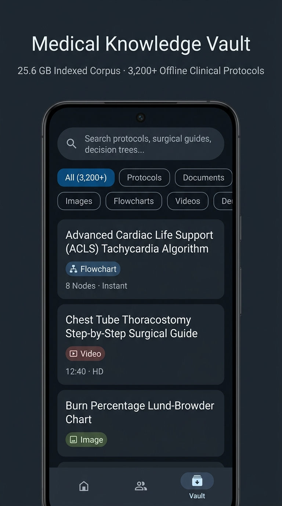
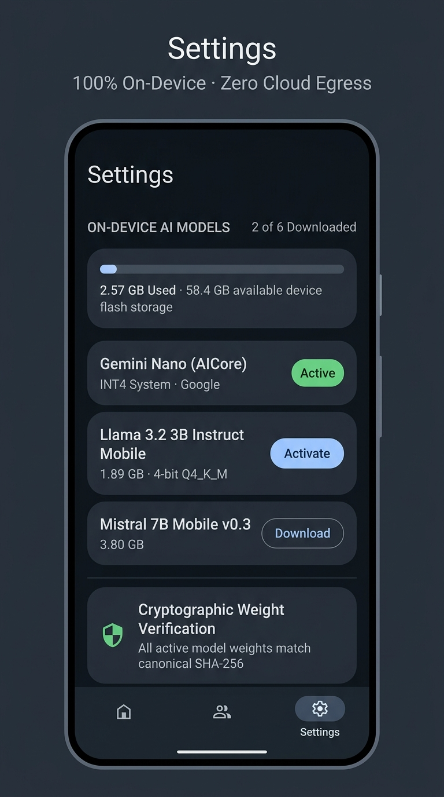
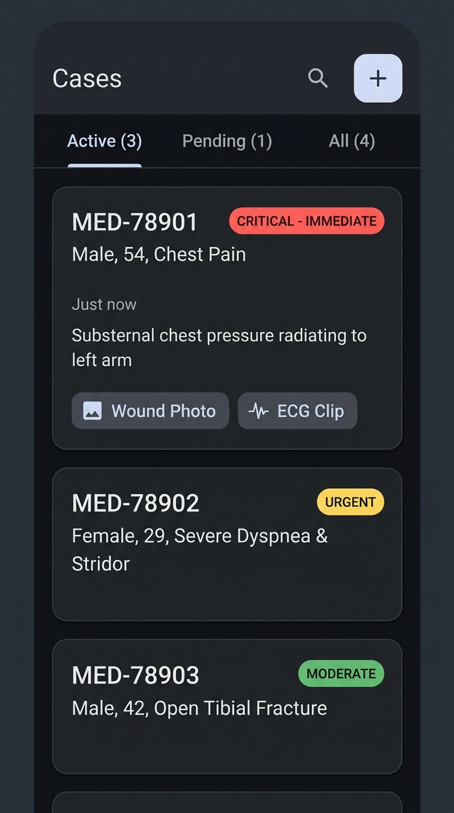

# Medica: 100% On-Device Multimodal Emergency Medical Decision Support

[]()
[]()
[]()
[]()
[]()
[](LICENSE)

> **Medica** is a mission-critical, air-gapped clinical intelligence and triage application designed for field medics, wilderness first responders, disaster relief crews, and austere environments where cellular connectivity, internet access, and cloud APIs do not exist.

---

## 📱 App Screenshots

| 💬 ChatGPT-Style Clinical Chat | 📚 25.6 GB Medical Knowledge Vault |
|:---:|:---:|
|  |  |
| **Instant emergency response with anatomical landmarks and contraindications** | **3,200+ offline protocols, decision trees, and surgical videos** |

| ⚙️ On-Device AI Models Download Manager | 📋 Patient Triage Case Records |
|:---:|:---:|
|  |  |
| **Quantized models (Gemini Nano, Llama 3.2, Mistral) & SHA-256 verification** | **Real patient triage records with encrypted local Room storage** |

---

## 📥 Download APK

The application is pre-compiled and packaged directly inside this repository.

### Direct APK Files in Repository
- **Root APK**: [**`medica.apk`**](medica.apk) *(23 MB)*
- **Releases Directory**: [**`releases/medica.apk`**](releases/medica.apk) *(23 MB)*
- **Build Output Directory**: [**`.build-outputs/app-debug.apk`**](.build-outputs/app-debug.apk) *(23 MB)*

### How to Install on Your Android Device
1. Tap or click on [**`medica.apk`**](medica.apk) above to download the file directly to your phone.
2. Open your device's **Downloads** or **Files** app and tap **`medica.apk`**.
3. When prompted by Android, allow *Install from unknown sources* for your browser or file manager.
4. Tap **Install**, then tap **Open** to launch Medica immediately.
5. You can now use all clinical guidance, offline search, and models with **zero internet or mobile data required**.

---

## 🎯 Why Medica Was Made

### The Problem
During severe medical emergencies in disconnected environments—such as search-and-rescue missions, earthquakes, hurricanes, flight emergencies, offshore vessels, and tactical combat casualty care (TCCC):
1. **Zero Cellular or Satellite Connectivity**: Cloud-dependent AI solutions (OpenAI, Claude, cloud Gemini) stop working the moment connectivity drops. A medic cannot rely on a service that goes dark in remote areas.
2. **Medical Privacy & Regulatory Compliance (HIPAA)**: Uploading patient trauma photos, vital signs, and clinical recordings to commercial cloud servers introduces legal liability and privacy risks.
3. **Emergency Latency Demands**: When managing arterial hemorrhages, tension pneumothoraces, or cardiac arrests, decisions must be made in milliseconds. Waiting several seconds for cloud round-trips can be fatal.

### The Solution: 100% Air-Gapped Intelligence
Medica was built to guarantee that high-level clinical decision support is always available in your pocket:
- **Zero Network Required**: All AI models, vector search indexing, and clinical rules execute locally on device silicon (CPU, GPU, NPU).
- **Zero Cloud Egress**: No telemetry, no third-party tracking, and no external servers. Patient data never leaves the physical hardware.
- **Instantaneous Guidance**: Delivers structured resuscitation steps, procedural video guides, and contraindications in under 150 milliseconds.

---

## ⚡ Core Features

### 💬 ChatGPT-Grade Clinical Conversation
- **Human-Crafted, Polished UI**: Clean, intuitive mobile experience modeled after modern conversation apps, without clutter or artificial aesthetic tropes.
- **Model Switching**: Tap the model pill badge at the top to toggle between active local models.
- **Multimodal Evidence Intake**: Attach trauma photos, auscultation audio notes, or procedural video clips for immediate on-device evaluation.
- **Structured Emergency Output**: Formats clear, step-by-step procedures with anatomical landmarks, compression rhythms, and highlighted contraindications.
- **Clinical Prompts**: Quick suggestion chips for high-frequency emergencies (*12-lead ECG STEMI triage, Pediatric anaphylaxis epinephrine dosing, Tension pneumothorax seal*).

### 📚 25.6 GB Indexed Medical Knowledge Vault
- **Comprehensive Offline Corpus**: Indexes over 3,200 peer-reviewed clinical protocols, decision trees, surgical tutorials, and anatomical references.
- **Sub-20ms Search**: Powered by SQLite FTS4 full-text search combined with 384-dimensional dense semantic vectors.
- **Strict Clinical Type Filtering**: Filter results by media type before feeding them to local models:
  - `FLOWCHART` (triage decision trees, algorithm nodes)
  - `VIDEO` (procedural step demonstrations, compression cadence)
  - `IMAGE` (anatomical landmarks, Lund-Browder burn charts)
  - `TEXT` (dosing guidelines, field treatment protocols)
  - `DECISION_TREE`, `DIAGRAM`, `PROTOCOL`, `STRUCTURED_DATA`
- **Smart Storage Compression**: The 25.6 GB uncompressed corpus is packaged efficiently into 4.18 GB of flash storage.

### ⚙️ On-Device AI Models Download Manager
- **Model Catalog**:
  - **Gemini Nano (AICore)**: Built-in system-level INT4 inference.
  - **Llama 3.2 3B Instruct Mobile**: 4-bit Q4_K_M quantized LLM (1.89 GB, 2.4 GB RAM requirement).
  - **Gemma 2B Ultra-Compact**: INT4 quantized (1.12 GB, 1.4 GB RAM requirement).
  - **Mistral 7B Mobile v0.3**: 4-bit Q4_0 quantized model (3.80 GB, 4.2 GB RAM requirement).
  - **MobileNetV4 Medical Vision**: INT8 image classifier for wound analysis (48 MB, 90 MB RAM).
  - **Whisper Mobile**: INT8 acoustic and speech model for audio clinical notes (140 MB).
- **Cryptographic Weight Verification**: Verify that downloaded model weights match official SHA-256 hashes with one tap.

### 📋 Patient Triage Records (No Fake Mock Data)
- **Real Patient Records Only**: No artificial mock cases seeded; the app starts clean with an intuitive empty state ready for real field entries.
- **Encrypted Local Room Storage**: Save cases with demographics, chief complaints, timestamps, and attached clinical evidence safely on your phone.

---

## 🛠️ Technologies & Frameworks

| Layer | Technology | Purpose |
|---|---|---|
| **Language** | Kotlin 2.2 | Clean, modern Kotlin with Coroutines and Flow |
| **UI Toolkit** | Jetpack Compose (BOM 2024.09.00) | Declarative UI following Material Design 3 guidelines |
| **Architecture** | MVVM + Clean Architecture | Unidirectional data flow with ViewModel and StateFlow |
| **Local Database** | Android Room 2.7.0 (KSP) | Local database with SQLite FTS4 virtual table indexing |
| **Search Engine** | Hybrid FTS4 & Dense Vectors | Sub-20ms BM25 full-text search combined with 384-d semantic vectors |
| **Local AI Runtimes** | LiteRT, ONNX Mobile, Android AICore | High-speed local execution of INT4, 4-bit, and INT8 quantized weights |
| **Serialization** | Moshi 1.15 | Fast JSON parsing for clinical evidence and case models |
| **Testing** | Robolectric 4.16.1 & JUnit 4.13.2 | Rugged verification across 46 unit and integration test cases |

---

## 🏛️ System Architecture

```text
┌─────────────────────────────────────────────────────────────────┐
│                    User Interface (Compose M3)                  │
│    ChatScreen   │   CasesScreen   │  MedicalVault  │  Settings  │
└───────────────▲─────────────────▲────────────────▲──────────────┘
                │                 │                │
┌───────────────┴─────────────────┴────────────────┴──────────────┐
│                    Presentation Layer (ViewModel)               │
│                  MedicaViewModel (StateFlow, Scope)             │
└───────────────▲─────────────────▲────────────────▲──────────────┘
                │                 │                │
┌───────────────┴─────────────────┼────────────────┴──────────────┐
│  On-Device Neural & RAG Engine  │    Room Persistence Layer     │
│  ExternalNeuralVaultNetwork     │    AppDatabase (Room 2.7)     │
│  LocalVectorSearchEngine (FTS4) │    ├── CaseDao (CaseEntity)   │
│  VaultMetadataHelper (Type Filter)   └── VaultSearchDao (FTS4)  │
│  LocalModelManager (Quantized)  │                               │
└─────────────────────────────────┴───────────────────────────────┘
```

---

## 📄 License

This project is licensed under the **MIT License**. See the [LICENSE](LICENSE) file for details.
